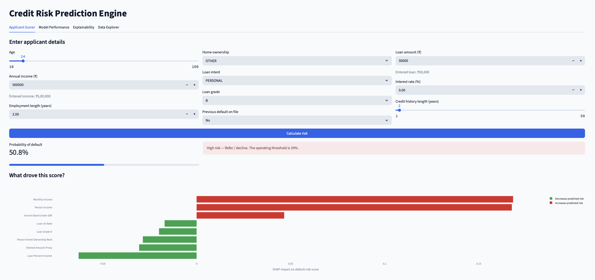
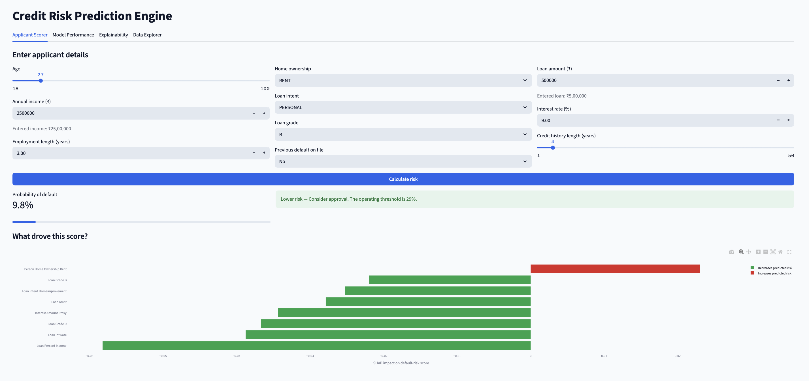

# Credit Risk Prediction Engine

A machine-learning web app that predicts whether a loan applicant is likely to
default. The project compares multiple models, deploys the best-performing
Random Forest model, explains predictions with SHAP, and presents everything in
an easy-to-use Streamlit dashboard.





## What this project does

- Predicts loan default risk from applicant, income, loan, and credit-history
  details.
- Compares Logistic Regression, Random Forest, XGBoost, and CatBoost.
- Uses Random Forest as the deployed model because it gives the strongest
  overall performance in the current evaluation.
- Shows model performance with ROC-AUC, PR-AUC, precision, recall, and F1-score.
- Explains predictions using SHAP so the user can understand which factors
  pushed the risk score higher or lower.
- Converts user-facing monetary values to Indian rupees in the Streamlit app.

> This is an educational decision-support project, not a production lending
> system. A real lending system would also need policy validation, fairness
> testing, legal review, monitoring, and governance.

## Model performance

Random Forest is currently deployed.

| Metric | Random Forest result |
|---|---:|
| Accuracy | 0.864 |
| ROC-AUC | 0.937 |
| PR-AUC | 0.893 |
| F1-score for default class | 0.734 |
| Operating threshold | 0.29 |

The threshold is optimized for credit-risk decision support instead of simply
using the default `0.5` cutoff.

## How to use the app

1. Open the **Applicant Scorer** tab.
2. Enter applicant details such as age, income, home ownership, loan amount,
   loan intent, loan grade, interest rate, previous default status, and credit
   history length.
3. Click **Calculate risk**.
4. Review the predicted default probability and recommendation.
5. Check the SHAP explanation to understand the main factors affecting the
   prediction.

## Run tests

```bash
pytest -q
```

Expected result:

```text
3 passed
```

## Key learning points

This project demonstrates:

- end-to-end machine-learning project structure
- model comparison and evaluation
- threshold tuning for business-sensitive classification
- Streamlit dashboard development
- SHAP-based model explainability
- reproducible training and testing workflow

## Interview-ready summary

I built an end-to-end credit-risk prediction system using a 32K-row loan dataset.
The project compares Logistic Regression, Random Forest, XGBoost, and CatBoost,
deploys Random Forest based on the strongest evaluation results, tunes the
classification threshold for lending risk, explains predictions with SHAP, and
serves the full workflow through a Streamlit dashboard.
